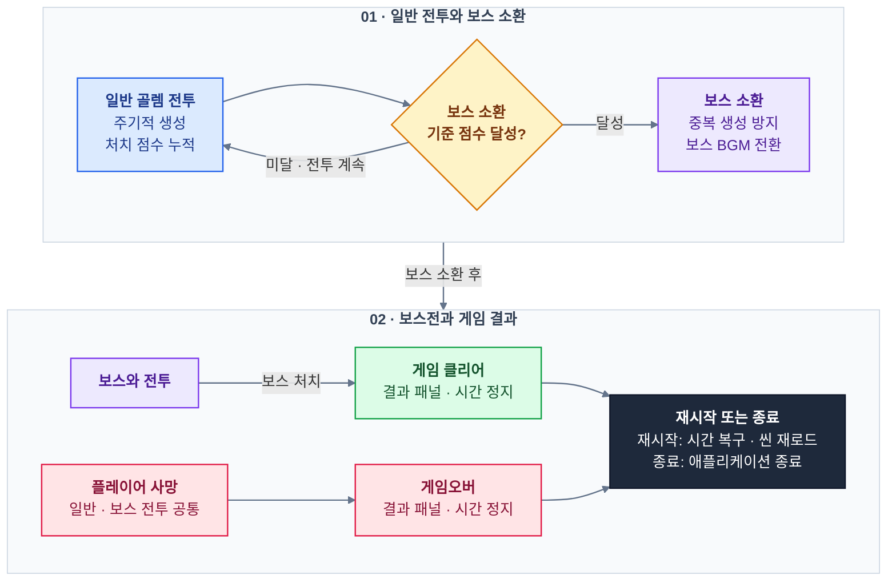

# Return Of the Arcane — C# · Unity 3D 팀 프로젝트

**Unity와 C**#으로 개발한 **Return Of the Arcane** 이름의 **2인 팀 창작 3D 마법 전투·생존 액션 게임**입니다. 일반 골렘을 처치해 점수를 획득하고, 누적 점수로 소환된 보스를 쓰러뜨리는 플레이로 구성했습니다.
**프레임워크·맵 구성·물리 효과·게임 흐름 설계·애니메이션**을 주로 담당했습니다.
## [GitHub Repository](https://github.com/Nu-LungJi/Unity3D_Team_Project)
## [게임 시연 영상 (Demo Video)](https://youtu.be/IIL6rAAqU5w)

## [게임 발표자료 (PDF)](https://github.com/Nu-LungJi/Unity3D_Team_Project/blob/Master/README%20UNITY3D%20TEAM%20-%20Presentation.pdf)

| 항목     | 내용                                                                       |
| ------ | ------------------------------------------------------------------------ |
| 개발 기간  | 2024.11.14 ~ 2024.12.18 (5주)                                             |
| 개발 인원  | 2인 팀                                                                     |
| 플랫폼    | Windows PC / x64                                                         |
| 장르     | 3인칭 마법 전투 · 생존 액션                                                        |
| 플레이 구성 | 일반 골렘 처치 → 점수 획득 → 보스 소환 → 보스 처치                                         |
| 주요 담당  | 프레임워크 · 맵 구성 · 물리 효과 · 게임 흐름 설계 · 애니메이션                                  |
| 사용 기술  | C# · Unity · CharacterController · Input System · Animator · Cinemachine |

## 주요 기술 구현

| 번호 | 기술 | 핵심 구현 |
| --- | --- | --- |
| **1** | **컴포넌트·프리팹 기반 구성** | 조작·체력·적 행동·UI 역할 분리, 투사체·이펙트·몬스터 프리팹 생성 |
| **2** | **카메라 기준 이동·애니메이션** | 입력 보간, CharacterController 이동·점프, Animator 이동 블렌딩 |
| **3** | **조준 투사체·마법 스킬** | Raycast 목표 설정, 구형·박스 범위 공격, 이동 속도 버프 |
| **4** | **몬스터 AI·처치 보상** | 거리 기반 추적·공격 전환, 종류별 체력·점수, 중복 사망 처리 방지 |
| **5** | **점수 기반 게임 진행** | 일반 몬스터 반복 생성, 점수 누적·보스 소환, 클리어·게임오버 연결 |
| **6** | **조준 카메라 전환** | Cinemachine 카메라 우선순위 변경, 일반·조준 Canvas 전환 |
| **7** | **전투 UI·사운드** | 체력·점수·쿨타임 표시, 공격 효과음, 보스 등장 음악 전환 |

아래는 **팀 프로젝트의 주요 구현 구조와 동작**을 정리한 내용입니다. 개인의 주요 담당 범위는 위의 프레임워크·맵 구성·물리 효과·게임 흐름 설계·애니메이션입니다.

### 1. Unity 컴포넌트와 프리팹 기반 게임 구성

`MonoBehaviour`를 기반으로 **플레이어 조작·체력·적 행동·게임 진행의 역할을 분리**했습니다. 투사체·스킬 이펙트·몬스터는 프리팹으로 구성해 필요한 시점에 생성하고, 이동 속도·공격 범위·피해량·이펙트 참조는 Inspector에서 설정합니다.

| 구성                            | 역할                      |
| ----------------------------- | ----------------------- |
| `PlayerController`            | 이동·점프·공격·스킬 입력 처리       |
| `PlayerHealth`                | 피해·사망 처리와 UI에 피해량 전달    |
| `Giant_Golem` · `BossMonster` | 일반 몬스터·보스의 행동, 체력·피해 처리 |
| `GameManager`                 | 일반 몬스터 반복 생성            |
| `PlayerUIManager`             | 점수 누적, 보스 소환, 결과 화면 연결  |
아래는 소환·전투·결과 처리 사이의 주요 연결 관계입니다.

관련 코드: `PlayerController.cs` · `PlayerHealth.cs` · `Giant_Golem.cs` · `BossMonster.cs` · `GameManager.cs` · `PlayerUIManager.cs`

### 2. 카메라 기준 이동과 애니메이션 블렌딩

`CharacterController`와 **Unity Input System**으로 캐릭터를 조작합니다. 이동 입력을 카메라의 전방·우측 방향으로 변환하고, 보간한 입력을 이동과 애니메이션에 함께 사용합니다.

- **입력 보간:** `Vector2.SmoothDamp`로 입력 변화를 부드럽게 반영합니다.
- **이동 애니메이션:** Animator의 `MoveX`·`MoveZ` 파라미터로 이동 동작을 블렌딩합니다.
- **점프·낙하:** `isGrounded`로 접지를 확인하고, 수직 속도에 중력을 누적합니다.
- **방향 전환:** 카메라의 수평 회전값을 기준으로 캐릭터 회전을 보간합니다.

이동·점프는 매 프레임 입력 상태를 확인하고, 기본 공격·스킬은 `InputAction.performed` 이벤트에 연결했습니다.

관련 코드: `PlayerController.cs`

### 3. 조준점 기반 투사체와 마법 스킬

**카메라 조준 방향으로 목표를 정하고, 캐릭터의 발사 위치에서 투사체를 생성**합니다. 카메라 전방 Raycast의 충돌 지점을 목표로 사용하며, 충돌 지점이 없으면 전방의 지정 거리를 목표로 설정합니다.

| 공격 | 구현 내용 |
| --- | --- |
| **기본 공격** | 발사 위치에서 조준 목표로 이동하는 마법 투사체 |
| **Q 스킬** | `Physics.OverlapSphere`로 주변 구형 범위의 적 조회 |
| **E 스킬** | `Physics.OverlapBox`에 캐릭터 회전을 적용한 전방 범위 공격 |
| **R 스킬** | 일정 시간 이동 속도 증가 후 코루틴으로 원래 속도 복구 |

`LayerMask`로 적 레이어를 선별하고, 대상의 몬스터 컴포넌트에 피해를 전달합니다. 스킬별 재사용 시간을 적용하고, 이펙트 프리팹의 위치·크기·수명을 공격 범위와 연동했습니다.

관련 코드: `PlayerController.cs` · `BulletController.cs`

### 4. 거리 기반 몬스터 AI와 처치 보상

일반 골렘과 보스는 플레이어를 대상으로 **거리에 따라 추적·공격을 전환**합니다. `Vector3.MoveTowards`로 접근하고, `Quaternion.Lerp`로 방향을 바꾸며, 공격 거리 안에서는 이동을 멈추고 Animator 파라미터를 변경합니다.

- **일반 몬스터:** Normal·Blue·Red 3종에 서로 다른 체력과 처치 점수를 적용합니다.
- **피격·사망:** 누적 피해에 따라 피격 또는 사망 애니메이션으로 전환합니다.
- **중복 처리 방지:** `isDead`로 반복 사망 처리를 막고, 점수 지급 이후 일정 시간이 지나면 객체를 제거합니다.
- **보스 처치:** 사망 시 클리어 UI를 호출해 게임 결과로 연결합니다.

관련 코드: `Giant_Golem.cs` · `BossMonster.cs`

### 5. 점수 기반 보스 소환과 게임 진행

일반 골렘을 일정 주기로 생성하고, **처치 점수가 기준에 도달하면 보스를 소환**합니다. 보스 소환 여부를 별도로 관리해 중복 생성을 방지하고, 등장 시 배경음악을 전환합니다.

- **일반 몬스터 생성:** 등록된 3종 프리팹 중 하나를 무작위로 선택해 스폰 위치에 배치합니다.
- **진행 상태 표시:** 처치 점수를 게이지에 반영해 보스 소환까지의 진행을 보여줍니다.
- **게임 결과:** 플레이어 사망 또는 보스 처치 시 결과 패널을 표시하고 `Time.timeScale`을 0으로 설정합니다.
- **재시작·종료:** 재시작은 시간 배율을 복구한 뒤 현재 씬을 다시 불러오고, 종료는 애플리케이션 종료로 연결합니다.

관련 코드: `GameManager.cs` · `PlayerUIManager.cs` · `PlayerHealth.cs` · `BossMonster.cs`

### 6. Cinemachine 조준 카메라 전환

**Cinemachine Virtual Camera의 Priority**를 변경해 일반 시점과 조준 시점을 전환합니다. 마우스 우클릭을 유지하면 조준 카메라의 우선순위를 높이고, 해제하면 원래 우선순위로 복구합니다.

카메라 전환에 맞춰 일반·조준용 Canvas 표시를 바꾸고, 이동 방향과 투사체 목표는 메인 카메라 Transform을 기준으로 계산합니다. 시점 전환은 `SwitchVCam`, 이동·공격은 `PlayerController`로 역할을 나눴습니다.

관련 코드: `SwitchVCam.cs` · `PlayerController.cs`

### 7. 전투 UI와 사운드 연동

Unity UI의 `Image.fillAmount`로 **체력·점수·스킬 쿨타임**을 표시하고, 전투 상태를 결과 화면과 사운드에 연결했습니다.

| 요소 | 구현 내용 |
| --- | --- |
| **체력·점수** | 피해와 처치 결과를 게이지 비율에 반영 |
| **스킬 쿨타임** | Q·E·R 입력에 따라 코루틴으로 이미지 채움 비율 변경 |
| **결과 화면** | 게임오버·클리어 패널과 재시작·종료 버튼 연결 |
| **공격·스킬 효과음** | 효과음용 `AudioSource`로 입력에 맞춰 재생 |
| **보스 등장** | 기존 배경음악을 중단하고 보스 음악·등장 효과음 재생 |

관련 코드: `PlayerUIManager.cs` · `EffectSoundManager.cs`

## 개발 환경

| 분류 | 기술 |
| --- | --- |
| 게임 엔진 | Unity 2022.3.27f1 |
| 언어 | C# |
| 이동·입력 | CharacterController · Unity Input System |
| 애니메이션·카메라 | Animator · Cinemachine |
| UI·사운드 | Unity UI · AudioSource |
| 개발 도구·협업 | Visual Studio 2022 · Google Drive |
